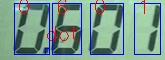
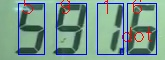
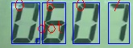
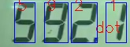
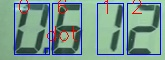
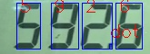
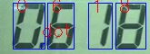
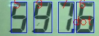
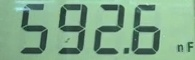

# LCR meter reading
Reading values of a LCR meter footage based on Seven Segment Optical Character Recognition created by jiweibo in this [repository](https://github.com/jiweibo/SSOCR.git)

## Algorithm


```
DIGITS_LOOKUP = {
    (1, 1, 1, 1, 1, 1, 0): 0,
    (1, 1, 0, 0, 0, 0, 0): 1,
    (1, 0, 1, 1, 0, 1, 1): 2,
    (1, 1, 1, 0, 0, 1, 1): 3,
    (1, 1, 0, 0, 1, 0, 1): 4,
    (0, 1, 1, 0, 1, 1, 1): 5,
    (0, 1, 1, 1, 1, 1, 1): 6,
    (1, 1, 0, 0, 0, 1, 0): 7,
    (1, 1, 1, 1, 1, 1, 1): 8,
    (1, 1, 1, 0, 1, 1, 1): 9,
    (0, 0, 0, 0, 0, 1, 1): '-'
}
```

Digital recognition of seven-segment digital tube is relatively simple compared to handwritten numeral.

Detect the existence of the corresponding bit, then encode the image, you can accurately identify the number.

## Setup
### Windows
```
git clone https://github.com/NgShienMing/lcr-reading.git

python -m venv .venv
.\.venv\Scripts\Activate.ps1
pip install --upgrade pip
pip install -r requirements.txt
```

## Results

 <br>

 <br>

 <br>

 <br>

```
python ssocr_module.py asset\test\test_0x601.jpg -s
Number:  0.601

python ssocr_module.py asset\test\test_0x607.jpg -s
Number:  0.607

python ssocr_module.py asset\test\test_0x612.jpg -s
Number:  0.612

python ssocr_module.py asset\test\test_0x618.jpg -s
Number:  0.618

python ssocr_module.py asset\test\test_591x6.jpg -s
Number:  591.6

python ssocr_module.py asset\test\test_592x1.jpg -s
Number:  592.1

python ssocr_module.py asset\test\test_592x6.jpg -s
Number:  592.6

python ssocr_module.py asset\test\test_597x6.jpg -s
Number:  597.6
```

## Notes
```
cropped = frame[460:520, 185:380]
number_region = cropped[:, 0:175]
unit_region = cropped[40:60, 175:186]
```
This section of code in main.py requires manual tuning to crop the frame until only the value and unit are in the frame as shown in the image below <br>
 <br>

## Acknowledge
[SSOCR](https://www.unix-ag.uni-kl.de/~auerswal/ssocr/)